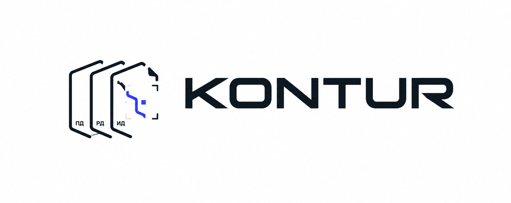
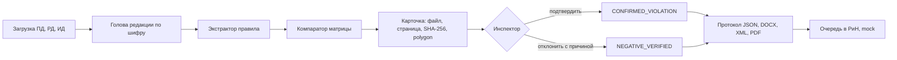

<p align="center">
  
</p>

<p align="center">
  <a href="https://github.com/KonkovDV/Kontur/raw/main/submission/03-presentation/Kontur.pptx"></a>
  <a href="https://github.com/KonkovDV/Kontur/blob/main/submission/03-presentation/Kontur.pdf"></a>
</p>

<p align="center">
  <a href="https://github.com/KonkovDV/Kontur/actions/workflows/ci.yml"></a>
  
  <a href="docker-compose.offline.yml"></a>
  <a href="contracts/openapi.yaml"></a>
  
  <a href="docs/METRICS.md"></a>
</p>

# Контур — «Инспектор ИИ»

Сервис камеральной сверки проектной (ПД), рабочей (РД) и исполнительной (ИД)
документации по матрице из 132 контролируемых параметров. Задача №10,
Мосгосстройнадзор.

Контур находит расхождение между стадиями и показывает его доказательство:
файл, страницу, SHA-256 источника и область на листе. Решение принимает
инспектор. Система его не заменяет и нарушение сама не подтверждает.

Репозиторий публичный. Код передаётся заказчику задачи, открытой лицензии
на него нет. Срез 28.09.2026.
Гейты приёмки I/J/K/L открыты.

**Для жюри:** [пакет формы](submission/README.md) ·
[досье](submission/02-documentation/README.md) ·
[протокол запуска](submission/04-prototype/README.md) ·
[реестр доказательств](submission/05-additional/README.md) ·
[пример JSON](submission/05-additional/examples/README.md)

## Коротко

- **Что делает.** Выбирает актуальную редакцию тома по шифру, достаёт значение
  параметра со страницы, сравнивает стадии по правилу матрицы и собирает
  карточку доказательства. Инспектор подтверждает или отклоняет, протокол
  собирается в JSON, DOCX, XML и PDF.
- **Что уже работает.** Стенд одной командой и офлайн из tar. Учебный комплект
  проходит цепочку от загрузки до финализированного протокола. 55 из 132
  правил имеют рабочий экстрактор.
- **Что измерено.** Публичный gold: 0 из 6 позитивов матрицы и 0 из 4
  свободного поиска. OCR на SILVER — ниже порога, статус `MEASURED`.
  Это не пороги ТЗ, подробности — [реестр доказательств](submission/05-additional/README.md).
- **Чего нет.** Frozen validation, пяти сессий инспекторов, живого РиН.
  Из 132 правил 72 без экстрактора, 4 без источника в пакете, 1 advisory.
- **Как запустить.** `docker compose -f docker-compose.yml -f docker-compose.demo.yml up -d --build`,
  затем http://127.0.0.1:3000.

## Задача заказчика

Инспектор получает комплект томов трёх стадий и сверяет их вручную: площадь
застройки в ПД и в РД, класс бетона, ширину проёма, сечение воздуховода.
Параметров 132, томов десятки, у тома бывает несколько редакций, часть листов —
скан без текстового слоя. Ошибка на этом пути бывает двух видов: пропущенное
расхождение и «нарушение», которое на деле вызвано неполным комплектом или
чужой редакцией.

Контур закрывает ту часть работы, где человек тратит время, но не принимает
юридического решения:

1. Находит голову редакции каждого тома по шифру, а не по имени файла.
2. Достаёт значение параметра из текстового слоя страницы. Если слоя нет —
   распознаёт страницу локально.
3. Сравнивает значения стадий по правилу матрицы и собирает доказательство.

Решение остаётся у инспектора. Нет документа стадии — это не нарушение.
Не найдено значение — это отказ, а не «соответствует».

Единица результата — точка `object_id + parameter_code + location`
(ответ организатора 14). Сверяются документы между собой: ПД с РД и ИД,
а не проект с СНиП ([ADR-0006](docs/adr/0006-compare-documents-not-norms.md)).

## Как устроено



| Шаг | Что делает | Решение |
|---|---|---|
| Редакция | Голова цепочки predecessor/successor внутри шифра. Пустой шифр чужой том не прячет. Единственная голова ПД без штампа сравнивается с основанием `SOLE_HEAD` и плашкой «утверждение не подтверждено». Две головы одного шифра и явный «не утв.» — `CLARIFICATION_REQUIRED` | [ADR-0003](docs/adr/0003-revision-resolver-before-comparison.md), [ADR-0017](docs/adr/0017-sole-head-without-stamp.md) |
| Извлечение | Сначала вектор страницы через pdfium, координаты после CropBox, MediaBox и Rotate. Пустой слой — локальный OCR: eslav PP-OCRv5, затем Tesseract. DOCX — абзацы и таблицы | [`OCR_BAKEOFF.md`](docs/OCR_BAKEOFF.md) |
| Правило | 132 параметра лежат данными в [`data/matrix/`](data/matrix/), не кодом. Правило без экстрактора остаётся `extractor_missing` и нарушения не выдаёт | [ADR-0004](docs/adr/0004-rules-are-data.md) |
| Вердикт | Детерминированный компаратор: допуск, округление, лестница классов. Помещения сравниваются по всем парам листов выше порога правила; спор одного номера гасит только его. Латинские B и P в метке читаются как В и П. Модель не пишет `finding_status` | [ADR-0001](docs/adr/0001-llm-never-sets-verdict.md) |
| Доказательство | Предметная находка не сохраняется без `evidence_group_id`, SHA-256 источника, страницы и polygon | [ADR-0002](docs/adr/0002-evidence-group-is-the-unit.md) |
| Решение | Автомат останавливается на `CANDIDATE`. `CONFIRMED_VIOLATION` пишет только инспектор. Отклонение требует причины. Каждое решение — запись аудита с автором | [ADR-0005](docs/adr/0005-status-domains-are-separate.md) |
| Протокол | Материализуется атомарно с версией. В РиН уходит через outbox. Подтверждение брокера — не ACK РиН | [ADR-0009](docs/adr/0009-atomic-protocol-materialization.md), [ADR-0010](docs/adr/0010-outbox-relay-to-broker.md) |

## Слова на экране

| Слово | Смысл |
|---|---|
| `CANDIDATE` | Расхождение подготовлено. Подтверждает его только инспектор |
| `CLARIFICATION_REQUIRED` | Эталон редакции не выбран, сравнения нет |
| `ABSTAIN` | Значение не прочитано или вердикты по одному помещению спорят. Это отказ, не соответствие |
| `SOLE_HEAD` | Единственная голова ПД без штампа сравнивается. Штамп не переписывается |
| `MISSING_EVIDENCE` | Документа стадии нет. Это не нарушение |

## Почему так, а не «модель читает и решает»

Выбор архитектуры опирается на открытые источники 2026 года. Их цифры —
ориентир, а не замер Контура. Разбор — [`PLAN_2026_09_28_29.md`](docs/PLAN_2026_09_28_29.md)
и [`RESEARCH_OSINT_2026.md`](docs/RESEARCH_OSINT_2026.md).

| Наблюдение | Что из него следует |
|---|---|
| Подсчёт однотипных объектов на плане у моделей слабый (AECV-Bench, arXiv:2601.04819) | Такие правила остаются `extractor_missing`, а не угадываются |
| Корпус OmniDocBench v1.6 в основном китайско-английский, VLM-бэкенды его лидеров требуют GPU | Цифры бенчмарка точностью Контура не называются. В офлайн-прогон на CPU лидеры не переносились |
| PP-OCRv6 (PaddleOCR 3.7.0) русский не распознаёт | Для кириллицы остаётся eslav PP-OCRv5 с локальными весами |
| PDF — недоверенный вход, возможны инъекции через текст документа | Модель не пишет статус. Вердикт — код компаратора |
| Проверка ограничений на новых проектах даёт ложные «соответствует» (arXiv:2607.29058) | Вердикт у инспектора, разбиение выборок по `object_id` |
| Облачные OCR и VLM в зачётный прогон нельзя (ответ организатора 23) | Всё локально: веса в образе, сеть для работы не нужна |

## Запуск за пять минут

Нужны Docker Compose v2 и свободные порты на `127.0.0.1`: `3000`, `8000`,
`5432`, `6379`, `5672`, `15672`, `9000`, `9001`. GPU и GNU make не нужны.
Ядро по умолчанию ограничено 8 CPU и 8 ГБ. На машине меньше 8 CPU задайте
`KONTUR_CORE_CPUS`.

```text
docker compose -f docker-compose.yml -f docker-compose.demo.yml up -d --build
```

| Адрес | Что там |
|---|---|
| http://127.0.0.1:3000 | Экран инспектора |
| http://127.0.0.1:3000/api/v1/healthz | Проверка ядра через шлюз, 200 |
| http://127.0.0.1:8000/docs | Swagger ядра |
| http://127.0.0.1:8000/openapi.json | Контракт API |

Учебный токен: `inspector-1@OBJ-DEMO-COLD-START/INSPECTOR`. Это не учётная
запись промышленного контура. Защищённые маршруты без токена отвечают 401.
Перед сборкой задайте `KONTUR_GIT_SHA` — 40 символов `git rev-parse HEAD`:
каталог `.git` в образ не копируется. Сервер жюри открывает экран наружу
переменной `KONTUR_BIND=0.0.0.0`, базы и брокер остаются на `127.0.0.1`.

Без сети: `scripts/offline_bundle.sh` сохраняет собранные образы в tar с
`SHA256SUMS`, на целевой машине — `docker load` и тот же `up` с
`docker-compose.offline.yml` и `--no-build`. Записи прогонов 27.09 и 28.09 —
[`DEMO_COLD_START.md`](docs/DEMO_COLD_START.md). Сеть хоста в них не
отключалась. Это не чистая Linux-машина.

Без Docker:

```text
pip install -e "backend[dev]"
pytest backend/tests -q
python scripts/check_claims.py
```

Полный протокол со списком сервисов, проверкой после старта и неполадками —
[`submission/04-prototype`](submission/04-prototype/README.md).

## Сценарий на учебном комплекте

Кнопка «Учебный комплект» (или `python scripts/load_demo_kit.py`) кладёт
синтетические ПД, РД и ИД. Документы организатора на стенд не класть.

| Шаг | Действие | Что видно |
|---|---|---|
| 1 | Загрузить комплект | 132 находки. PZ-001, KR-055, AR-041 — `CLARIFICATION_REQUIRED`: в комплекте две редакции ПД |
| 2 | «Назначить эталоном» `f-pd` | Три `CANDIDATE`: площадь 1250,5 → 1100 м², класс бетона B30 → B25, проём 1,2 → 0,8 м |
| 3 | Открыть карточку | Правило, ожидание и факт, файл, страница, SHA-256, polygon на листе ПД и РД |
| 4 | Подтвердить PZ-001 и KR-055, отклонить AR-041 | `CONFIRMED_VIOLATION` ×2, `NEGATIVE_VERIFIED` ×1. Отклонение без `reason_code` — 409 |
| 5 | Завершить и финализировать | `PROTOCOL_FINALIZED`, `violation_count` 2. Незакрытый `CANDIDATE` финализацию блокирует |
| 6 | Скачать протокол | JSON, DOCX, XML, PDF из одного JSON |
| 7 | «Передать в РиН (mock)» | `PENDING_SYNC`. ACK РиН нет |

Шаги 1–7 пройдены через API на коде `main` 28.09, ответы записаны в
[протоколе запуска](submission/04-prototype/README.md#7-тот-же-сценарий-через-api).
Ответ участника на шагах 1 и 2 —
[`unattended`](submission/05-additional/examples/unattended/submission.json) и
[`after_etalon_select`](submission/05-additional/examples/after_etalon_select/submission.json).
От кандидата до записанного решения три действия: открыть, выбрать исход,
сохранить (ответ организатора 28). Это описание экрана, а не замер Gate K.

## Что работает и чего нет

| Работает | Не сделано или не измерено |
|---|---|
| Стенд одной командой, `healthz`, офлайн из tar | Прогон с физически отключённой сетью на чистом Linux |
| Голова редакции по шифру, `SOLE_HEAD`, выбор эталона инспектором | Frozen validation и пороги раздела 14 |
| Сравнение помещений по всем парам листов | FPR на публичном gold: отрицательных строк нет, доля не считается |
| 55 правил с экстрактором из 132 | 72 правила без экстрактора, 4 без источника, 1 advisory |
| Карточка: файл, страница, SHA-256, polygon | Пять сессий инспекторов (Gate K) |
| Решение инспектора, пачка только из `CANDIDATE`, аудит | Атомарное разделение находки, `split()` ([#83](https://github.com/KonkovDV/Kontur/issues/83)) |
| Протокол JSON, DOCX, XML, PDF из одного JSON | Живой РиН, УКЭП, OIDC |
| DOCX: абзацы и таблицы | Разбор XML, вложения PDF, распаковка архива внутри сервиса, DWG |
| Пакетный прогон и счёт с n и интервалом | OCR на уровне порога: статус `MEASURED` |
| Лимиты 50 МБ на файл и 200 МБ на пакет, `RATE_LIMITED` | VLM в сверке нет, изоляция VLM — [#84](https://github.com/KonkovDV/Kontur/issues/84) |

Покрытие по типам экстрактора и разделам матрицы —
[реестр доказательств](submission/05-additional/README.md#2-покрытие-матрицы).

## Метрики

Пороги раздела 14 ТЗ 1.1 — минимумы приёмки, а не результат Контура:
Character Accuracy не ниже 0,95, Exact Match полей не ниже 0,90, связка
документов не ниже 0,95, локализация не ниже 0,95 при IoU не ниже 0,50,
Precision не ниже 0,90, Recall не ниже 0,80, F1 не ниже 0,85, FPR не выше 0,10.
Гармоника P=0,90 и R=0,80 ≈ 0,847 и F1=0,85 не закрывает.

Порог считается взятым только по нижней границе 95% интервала на frozen
validation. Такой выборки нет, поэтому пороги не публикуются как достигнутые.

| Замер | Значение | Чем не является |
|---|---|---|
| Публичный gold, матрица, режим location | 0 из 6, интервал Wilson [0; 0,39] | Порогом раздела 14 |
| Публичный gold, свободный поиск | 0 из 4, интервал Wilson [0; 0,49] | Порогом раздела 14 |
| OCR eslav PP-OCRv5, SILVER, n=5935 | нижняя граница доли строк с CA не ниже 0,95 — 0,663 | Замером на GOLD |
| k6 на `/status`, GitHub Actions, n=6000 | p95 18,26 мс | Промышленным SLA |

Остановка на публичном gold — «якорь или число не найдены» в числовом проходе
IOS4. FPR на этом счёте не определён: отрицательных строк нет, ноль попаданий
из шести знаменателем ложных срабатываний не является. Пять повторов и что снимал каждый —
[`GOLD_DIAGNOSIS.md`](docs/GOLD_DIAGNOSIS.md). Пороги комнат по этим строкам
не подбирались. Методология и угрозы достоверности —
[досье, разделы 8 и 9](submission/02-documentation/README.md#8-методология-измерений).

## Как оценивают и где это проверить

Баллы Контур себе не начисляет. Итоговый рейтинг организатора — 30 баллов
экспертизы и 10 питча (ответ 13); при равенстве на этой шкале смотрят F1
и Recall. Таблица ниже — техническая доска ЛЦТ, максимум 20.

| Критерий доски | Баллы | Где проверить |
|---|---|---|
| Сквозной процесс ПД–РД–ИД | 4 | [Сценарий](#сценарий-на-учебном-комплекте), [протокол запуска](submission/04-prototype/README.md) |
| OCR и ключевые поля | 2 | [`OCR_BAKEOFF.md`](docs/OCR_BAKEOFF.md), реестр, раздел 4 |
| Связка документов | 1 | [ADR-0017](docs/adr/0017-sole-head-without-stamp.md), [`GOLD_DIAGNOSIS.md`](docs/GOLD_DIAGNOSIS.md) |
| Несоответствия | 3 | [Покрытие](submission/05-additional/README.md#2-покрытие-матрицы), [`data/matrix/`](data/matrix/) |
| Локализация и FPR | 2 | [`METRICS.md`](docs/METRICS.md), `python -m kontur.cli.score` |
| Доказательность | 3 | [ADR-0002](docs/adr/0002-evidence-group-is-the-unit.md), [пример JSON](submission/05-additional/examples/README.md) |
| Техническая готовность | 3 | [Запуск](#запуск-за-пять-минут), [`DEMO_COLD_START.md`](docs/DEMO_COLD_START.md), [CI](#качество-кода) |
| Сценарий инспектора | 2 | [Сценарий](#сценарий-на-учебном-комплекте). Сессий Gate K нет |

Пять полей формы на площадке i.moscow — репозиторий, документация,
презентация, прототип, дополнительные материалы — собраны в
[`submission/`](submission/README.md). Комплект технической проверки по
ответу О-2 (Dockerfile, compose, lock, веса, healthcheck, OpenAPI, пример JSON) —
[досье, раздел 3.1](submission/02-documentation/README.md#31-комплект-технической-проверки-ответ-о-2).

## Требования ТЗ и где их след

Построчная карта «пункт → артефакт → тест» и её статусы —
[`TZ_TRACEABILITY.md`](docs/TZ_TRACEABILITY.md). Статусы здесь не повышаются.

| Требование | Где в коде | Статус в карте |
|---|---|---|
| Матрица 132 параметров как данные (п. 8, прил. 1) | [`data/matrix/`](data/matrix/), [`rule.schema.json`](contracts/schemas/rule.schema.json) | in_progress: 55 executable |
| Разбор, OCR, координаты, выбор редакции (п. 9.1) | `application/process_pipeline.py`, `revision_resolver.py`, `infrastructure/pdfium_tokens.py` | in_progress: OCR `MEASURED` |
| Ошибки загрузки: формат, 50 МБ, 200 МБ, таймаут (п. 9.1) | `application/intake.py`, [`gateway/`](gateway/) | in_progress |
| Каскад остановок, карточка, протокол (п. 9.2) | `application/pipeline.py`, `evaluate.py`, `protocol.py` | in_progress |
| Решение, финализация, отмена (п. 9.3) | `application/review.py`, `domain/state_machines.py` | in_progress: `split()` нет |
| Разметка, карантин, разбиение по объекту (п. 9.4) | `evaluation/dataset_package.py`, `release_gate.py` | in_progress |
| Очередь в РиН (п. 9.6) | `infrastructure/outbox.py`, `sync_relay.py` | in_progress: sandbox РиН и УКЭП нет |
| Доступ и аудит (п. 12) | `presentation/auth.py`, `rbac.py` | in_progress: OIDC и TLS нет |
| Пороги и формат ответа (п. 14, прил. 2) | `evaluation/metrics.py`, `submission.py`, `cli/score.py` | in_progress: пороги не измерены |

Код ядра — [`backend/src/kontur/`](backend/src/kontur/).

## Границы, которые не нарушаются

- `CONFIRMED_VIOLATION` присваивает **только инспектор**. Система формирует
  `CANDIDATE` и карточку доказательства.
- LLM и VLM **никогда** не пишут итоговый статус находки.
- Предметная находка (`CANDIDATE`, `CONFIRMED_VIOLATION`, `NEGATIVE_VERIFIED`,
  внутренний `AUTO_NO_DIFFERENCE`) не сохраняется без `evidence_group_id`,
  источников с SHA-256 и координат. `MISSING_EVIDENCE` и `NOT_APPLICABLE`
  могут существовать без фрагментов.
- Отсутствие стадии, документа или доказательства — **не** нарушение:
  `MISSING_EVIDENCE`, `NOT_APPLICABLE`, `NOT_COMPARABLE`, `CLARIFICATION_REQUIRED`.
- Параметр не найден в загруженном документе — `LOW_QUALITY` или `ABSTAIN`,
  не нарушение и не «соответствует».
- Комплектность (`PD_UPLOADED`, `RD_PARTIAL`, `ID_MISSING`), процесс
  (`COMPLETED`, `FINALIZED`) и протокол (`VERIFICATION_COMPLETED`,
  `PROTOCOL_FINALIZED`) — разные проекции.
- Явная пометка «не утв.» эталоном не становится. `KONTUR_ETALON_POLICY=strict`
  возвращает поведение [ADR-0015](docs/adr/0015-missing-approval-is-clarification.md):
  ПД без сведений об утверждении — `CLARIFICATION_REQUIRED`.
- `AUTO_NO_DIFFERENCE` не уходит в протокол ТЗ и в РиН. На JSON участника
  совпадение уходит как `NO_VIOLATION`.
- Скрытый тест — карантин. `РАЗМЕЧЕННЫЙ_TEST__213.zip` и
  `РАЗМЕЧЕННЫЙ_TEST_HIDDEN_ОРГАНИЗАТОР_213` не открываются и для порогов не
  используются ([`DATASET_PACKAGE.md`](docs/DATASET_PACKAGE.md)).
- Официальный прогон локальный. Документы не уходят во внешние LLM, OCR и VLM.

Какой тест держит каждую границу —
[досье, раздел 7](submission/02-documentation/README.md#7-как-инварианты-держатся-кодом).

## Качество кода

На текущем `main`: 94 модуля ядра, 111 файлов `test_*.py`, pytest собирает 1265 тестов.

| Проверка | Где |
|---|---|
| `ruff check`, `mypy --strict`, `pytest` | job `backend` |
| Согласованность OpenAPI и JSON-схем | job `contracts`, [`check_contracts.py`](scripts/check_contracts.py) |
| Формулировки без заявлений о готовности | job `claims`, [`check_claims.py`](scripts/check_claims.py) |
| Схема БД, конкурентная финализация протокола, inbox на живой Postgres | job `db` |
| Типы TypeScript и тесты экрана | job `frontend` |
| Сборка и runtime-контракт образов, smoke core и gateway | jobs `container-*` |
| Relay и жизненный цикл синхронизации | `relay-container`, `sync-lifecycle-db` |

Ruleset `main-pr-and-ci`, id 23890545: изменения только через PR, force-push и
удаление ветки запрещены, все 11 checks обязательны. Прогон считается
зелёным, только если у job `backend` `conclusion=success` и `runner_id` не 0.

## Пакетный прогон и счёт

```text
docker compose --profile runner run --rm package-runner
```

Команда читает `input/` рядом с compose и пишет в `out/` (запись для uid 10001).
Без Docker:

```text
python -m kontur.cli.run_package --input <каталог> --out <каталог> [--pages-text]
python -m kontur.cli.score --submissions <каталог>
```

`run_package` читает `files_index.jsonl` или папки `<объект>/{ПД|РД|ИД}` и пишет
`submission_*.json`, `protocol_*.json`, `documents_*.json`, `fields_*.jsonl`,
`run_manifest.json`, с `--pages-text` — ещё слова страниц с bbox и движком.
Инспектор в пакете находки не подтверждает, `violation_count` остаётся 0.
Скрытый тест пропускается. Раскладка входа —
[`examples/demo_package/README.md`](examples/demo_package/README.md).

`score` проверяет ответ по `submission.schema.json`: невалидный ответ числа не
получает. Совпадение — `object_id`, код и `location`. Матрица и свободный поиск
считаются отдельно, с n и интервалом Wilson. Порог ТЗ команда не объявляет
взятым.

## Стек

| Часть | Технология |
|---|---|
| Ядро | Python 3.12 в образе (≥3.11 для разработки), FastAPI, pdfium |
| OCR | eslav PP-OCRv5 (ONNX, локальные веса), Tesseract |
| Шлюз | Node.js 22: лимиты размера и частоты, статика |
| Экран инспектора | React 18, TypeScript, Vite |
| Данные | PostgreSQL 16, Redis 7 (кеш паспортов), RabbitMQ 3.13, MinIO |
| Интеграция | Outbox с подтверждением брокера и transactional inbox. Брокер не есть РиН |

Базовые образы закреплены digest. Ядро и шлюз работают от пользователя 10001,
файловая система только на чтение, `cap_drop: ALL`, healthcheck.

## Карта репозитория

```text
contracts/      OpenAPI 3.1 (+ даунконверт 3.0) и JSON-схемы обмена — источник истины
backend/        Python: домен, сверка, инфраструктура, API, CLI пакетного прогона
gateway/        Node.js: вход, лимиты, раздача экрана
web/            React: экран инспектора с карточкой доказательства
data/matrix/    132 правила матрицы как данные, покрытие, триаж семейств
data/dataset/   Реестр поставки, публичный gold, карантин
vendor/ocr/     Локальные веса OCR
submission/     Пять полей формы сдачи
docs/           ADR, архитектура, метрики, трассируемость ТЗ, Red Team
```

## Документы

Для жюри:

| Тема | Файл |
|---|---|
| Пять полей формы сдачи | [`submission/README.md`](submission/README.md) |
| Досье: постановка, решения, методология | [`submission/02-documentation`](submission/02-documentation/README.md) |
| Архитектура и три контура | [`docs/ARCHITECTURE.md`](docs/ARCHITECTURE.md) |
| Метрики, n и интервал | [`docs/METRICS.md`](docs/METRICS.md) |
| Известные пробелы | [`docs/KNOWN_GAPS.md`](docs/KNOWN_GAPS.md) |
| Трассируемость ТЗ → артефакт → тест | [`docs/TZ_TRACEABILITY.md`](docs/TZ_TRACEABILITY.md) |
| Три контура готовности, не порог ТЗ | [`docs/TZ_SCORECARD.md`](docs/TZ_SCORECARD.md) |
| Ответы организатора | [`docs/ORGANIZER_ANSWERS_2026_09_26.md`](docs/ORGANIZER_ANSWERS_2026_09_26.md) |
| Архитектурные решения | [`docs/adr/`](docs/adr/) |
| Разбор публичного gold | [`docs/GOLD_DIAGNOSIS.md`](docs/GOLD_DIAGNOSIS.md) |
| OCR bake-off | [`docs/OCR_BAKEOFF.md`](docs/OCR_BAKEOFF.md) |
| Холодный запуск | [`docs/DEMO_COLD_START.md`](docs/DEMO_COLD_START.md) |
| Состав переданного пакета данных | [`docs/DATASET_PACKAGE.md`](docs/DATASET_PACKAGE.md) |
| Публичный gold не frozen validation | [`docs/ORGANIZER_GOLD.md`](docs/ORGANIZER_GOLD.md) |
| Red Team и stop-ship | [`docs/RED_TEAM.md`](docs/RED_TEAM.md) |
| Производительность и нагрузка | [`docs/PERFORMANCE.md`](docs/PERFORMANCE.md) |
| Лицензии сторонних пакетов | [`docs/THIRD_PARTY_NOTICES.md`](docs/THIRD_PARTY_NOTICES.md) |

Для сопровождения:

| Тема | Файл |
|---|---|
| Инварианты репозитория | [`AGENTS.md`](AGENTS.md) |
| Оперативный план 28–29.09 | [`docs/PLAN_2026_09_28_29.md`](docs/PLAN_2026_09_28_29.md) |
| Пакет сдачи, машиночитаемый | [`docs/SUBMISSION_PACK.md`](docs/SUBMISSION_PACK.md) |
| Карантин датасета | [`docs/DATA_QUARANTINE.md`](docs/DATA_QUARANTINE.md) |
| Нормативный реестр | [`docs/NORMATIVE_REGISTRY.md`](docs/NORMATIVE_REGISTRY.md) |
| Вопросы организатору | [`docs/QUESTIONS_TO_ORGANIZER.md`](docs/QUESTIONS_TO_ORGANIZER.md) |
| OSINT Document AI, срез 28.09 | [`docs/RESEARCH_OSINT_2026.md`](docs/RESEARCH_OSINT_2026.md) |
| Донор архитектуры AeroBIM | [`docs/SOTA_AEROBIM_ANALYSIS.md`](docs/SOTA_AEROBIM_ANALYSIS.md) |

## Права на код

Код Контура передаётся заказчику задачи. Открытой лицензии на него в
репозитории нет. Модели и пакеты третьих сторон остаются под лицензиями своих
авторов — [`docs/THIRD_PARTY_NOTICES.md`](docs/THIRD_PARTY_NOTICES.md).
