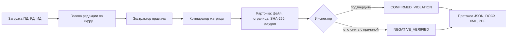

# Контур — «Инспектор ИИ»

Сервис камеральной сверки проектной (ПД), рабочей (РД) и исполнительной (ИД)
документации по матрице из 132 контролируемых параметров. Задача №10,
Мосгосстройнадзор.

Контур находит расхождение между стадиями и показывает его доказательство:
файл, страницу, SHA-256 источника и область на листе. Решение принимает
инспектор. Система его не заменяет и нарушение сама не подтверждает.

Репозиторий публичный. Лицензия кода — Apache-2.0. Срез 28.09.2026,
гейты приёмки I/J/K/L открыты.

**Для жюри:** [пакет формы сдачи](submission/README.md) ·
[архитектура](docs/ARCHITECTURE.md) · [метрики](docs/METRICS.md) ·
[что не сделано](docs/KNOWN_GAPS.md) · [пример JSON](submission/05-additional/examples/README.md)

## Задача

Инспектор получает комплект томов трёх стадий и сверяет их вручную: площадь
застройки в ПД и в РД, класс бетона, ширину проёма, сечение воздуховода.
Параметров 132, томов десятки, редакций у тома бывает несколько.

Контур делает три вещи, которые у человека занимают больше всего времени:

1. Находит актуальную редакцию каждого тома по шифру, а не по имени файла.
2. Достаёт значение параметра из текстового слоя страницы, а если слоя нет —
   распознаёт страницу локально.
3. Сравнивает значения стадий по правилу матрицы и собирает карточку
   доказательства.

Единица результата — точка `object_id + parameter_code + location`
(ответ организатора 14). Сверяются документы между собой: ПД с РД и ИД,
а не проект с СНиП ([ADR-0006](docs/adr/0006-compare-documents-not-norms.md)).

## Как устроено



- **Редакция.** Голова цепочки predecessor/successor внутри одного шифра.
  Пустой шифр чужой том не прячет. Единственная голова ПД без штампа
  сравнивается с основанием `SOLE_HEAD` и плашкой «утверждение не подтверждено»
  ([ADR-0017](docs/adr/0017-sole-head-without-stamp.md)). Две головы одного
  шифра и явный «не утв.» — `CLARIFICATION_REQUIRED`.
- **Извлечение.** Сначала вектор страницы через pdfium, координаты после
  CropBox, MediaBox и Rotate. Пустой слой — локальный OCR: eslav PP-OCRv5,
  затем Tesseract. DOCX читается абзацами и таблицами.
- **Правило.** 132 параметра лежат данными в [`data/matrix/`](data/matrix/),
  не кодом ([ADR-0004](docs/adr/0004-rules-are-data.md)). Правило без рабочего
  экстрактора остаётся `extractor_missing` и нарушения не выдаёт.
- **Вердикт.** Компаратор детерминированный: допуск, округление, лестница
  классов. Модель не пишет `finding_status` и не меняет результат сравнения
  ([ADR-0001](docs/adr/0001-llm-never-sets-verdict.md)).
- **Решение.** Автомат останавливается на `CANDIDATE`. `CONFIRMED_VIOLATION`
  пишет только инспектор. Отклонение требует причины. Каждое решение
  записывается в аудит с автором.

## Запуск за пять минут

Нужны Docker Compose v2 и свободные порты на `127.0.0.1`: `3000`, `8000`,
`5432`, `6379`, `5672`, `9000`. GPU и GNU make не нужны.

```text
docker compose -f docker-compose.yml -f docker-compose.demo.yml up -d --build
```

| Адрес | Что там |
|---|---|
| http://127.0.0.1:3000 | Экран инспектора |
| http://127.0.0.1:3000/api/v1/healthz | Проверка ядра через шлюз, 200 |
| http://127.0.0.1:8000/docs | Swagger ядра |
| http://127.0.0.1:8000/openapi.json | Контракт API |

Учебный токен: `inspector-1@OBJ-DEMO-COLD-START/INSPECTOR`. Это не учётная
запись промышленного контура. Защищённые маршруты без токена отвечают 401.

### Сценарий на учебном комплекте

Кнопка «Учебный комплект» (или `python scripts/load_demo_kit.py`) кладёт
синтетические ПД, РД и ИД. Документы организатора на стенд не класть.

1. До выбора эталона PZ-001, KR-055 и AR-041 в `CLARIFICATION_REQUIRED`:
   в комплекте черновик и утверждённая редакция одного тома.
2. «Назначить эталоном» файл `f-pd`. Те же три кода становятся `CANDIDATE`:
   площадь застройки 1250,5 → 1100, класс бетона B30 → B25,
   ширина проёма 1,2 → 0,8.
3. Открыть карточку: файл, страница, SHA-256, polygon на листе ПД и РД.
4. Подтвердить или отклонить с причиной. Отмеченные `CANDIDATE`
   подтверждаются пачкой. Массового отклонения нет.
5. Завершить проверку и финализировать. Протокол скачивается как JSON,
   DOCX, XML и PDF. «Передать в РиН (mock)» ставит очередь `PENDING_SYNC`.
   ACK РиН нет.

Так выглядит ответ участника на шагах 1 и 2:
[`unattended`](submission/05-additional/examples/unattended/submission.json) и
[`after_etalon_select`](submission/05-additional/examples/after_etalon_select/submission.json).

### Сервер жюри

Открыть экран с другой машины: `KONTUR_BIND=0.0.0.0`. Базы, RabbitMQ и MinIO
остаются на `127.0.0.1`. Ресурсы ядра: `KONTUR_CORE_CPUS` (по умолчанию 8) и
`KONTUR_CORE_MEM_LIMIT` (по умолчанию `8g`).

Перед сборкой задайте `KONTUR_GIT_SHA` — 40 символов `git rev-parse HEAD`.
Каталог `.git` в образ не копируется, без переменной `run_manifest.json`
пишет пустой `git_sha`. `up` не подменяет SHA, зашитый в образ. Статус
процесса читает `KONTUR_GIT_SHA`, затем `GITHUB_SHA`.

### Без сети

Когда образы уже собраны: `scripts/offline_bundle.sh` сохраняет их в tar
с `SHA256SUMS`, на целевой машине — `docker load` и

```text
docker compose -f docker-compose.yml -f docker-compose.demo.yml -f docker-compose.offline.yml up -d --no-build
```

Веса OCR лежат в [`vendor/ocr/`](vendor/ocr/). Сборка ядра сверяет их SHA-256
и не скачивает. Зависимости Python ставятся из `backend/requirements.lock`
по хешам. Прогоны 27.09 и 28.09 на Windows Docker записаны в
[`DEMO_COLD_START.md`](docs/DEMO_COLD_START.md): образы удалены, возвращены
`docker load`, `healthz` ответил 200. Сеть хоста не отключалась. Это не чистая
Linux-машина.

### Без Docker

```text
pip install -e "backend[dev]"
pytest backend/tests -q
python scripts/check_claims.py
```

## Пакетный прогон и счёт

```text
docker compose --profile runner run --rm package-runner
```

Команда читает `input/` рядом с compose и пишет в `out/` (запись для uid 10001).
То же без Docker:

```text
python -m kontur.cli.run_package --input <каталог> --out <каталог> [--pages-text]
python -m kontur.cli.score --submissions <каталог>
```

`run_package` читает `files_index.jsonl` или папки `<объект>/{ПД|РД|ИД}`.
Пишет `submission_*.json`, `protocol_*.json`, `documents_*.json`,
`fields_*.jsonl` и `run_manifest.json`. С `--pages-text` — ещё
`pages_text_<объект>.jsonl`: текст, bbox и `engine` (`vector` или `ocr`).
Инспектор в пакете находки не подтверждает, `violation_count` остаётся 0.
`RD_ID_MIXED` стадией не назначается. Скрытый тест пропускается. Таймаут
разбора PDF — 600 с на файл, если не задан `KONTUR_PDF_PARSE_TIMEOUT_S`.
Раскладка входа — [`examples/demo_package/README.md`](examples/demo_package/README.md).

`score` проверяет ответ по `submission.schema.json`. Невалидный ответ числа
не получает. По умолчанию совпадение — `object_id`, код и `location`.
Матрица и свободный поиск считаются отдельно, с n и интервалом Wilson.
Порог ТЗ команда не объявляет взятым.

## Что работает и чего нет

| Работает | Не сделано или не измерено |
|---|---|
| Стенд одной командой, `healthz`, офлайн из tar | Прогон с физически отключённой сетью на чистом Linux |
| Голова редакции по шифру, `SOLE_HEAD`, выбор эталона инспектором | Frozen validation и пороги раздела 14 |
| 55 правил с экстрактором из 132 | 72 правила без экстрактора, 4 без источника, 1 advisory |
| Карточка: файл, страница, SHA-256, polygon | Пять сессий инспекторов (Gate K) |
| Решение инспектора, пачка только из `CANDIDATE`, аудит | Атомарное разделение находки, `split()` ([#83](https://github.com/KonkovDV/Kontur/issues/83)) |
| Протокол JSON, DOCX, XML, PDF из одного JSON | Живой РиН, УКЭП, OIDC |
| DOCX: абзацы и таблицы | Разбор XML, вложения PDF, распаковка архива внутри сервиса, DWG |
| Пакетный прогон и счёт публичного gold с n и интервалом | OCR на уровне порога: статус `MEASURED` |
| Лимиты 50 МБ на файл и 200 МБ на пакет, `RATE_LIMITED` | Изоляция VLM ([#84](https://github.com/KonkovDV/Kontur/issues/84)): VLM в сверке нет |

Покрытие матрицы — 55 executable, 72 extractor_missing, 1 advisory,
4 source_missing из 132 ([`coverage_snapshot.json`](data/matrix/coverage_snapshot.json)).
Правило без экстрактора нарушением не становится.

## Метрики

Пороги раздела 14 ТЗ 1.1 — минимумы приёмки, а не результат Контура:
Character Accuracy не ниже 0,95, Exact Match полей не ниже 0,90, связка
документов не ниже 0,95, локализация не ниже 0,95 при IoU не ниже 0,50,
Precision не ниже 0,90, Recall не ниже 0,80, F1 не ниже 0,85, FPR не выше 0,10.
Гармоника P=0,90 и R=0,80 ≈ 0,847 и F1=0,85 не закрывает.

Порог считается взятым только по нижней границе 95% интервала на frozen
validation. Такой выборки нет, поэтому пороги не публикуются как достигнутые.

Что измерено, подробно — [`METRICS.md`](docs/METRICS.md) и
[`GOLD_DIAGNOSIS.md`](docs/GOLD_DIAGNOSIS.md):

| Замер | Значение | Чем не является |
|---|---|---|
| Публичный gold, матрица, режим location | 0 из 6, интервал Wilson [0; 0,39] | Порогом раздела 14 |
| Публичный gold, свободный поиск | 0 из 4 | Порогом раздела 14 |
| OCR, пилот SILVER, n=5935 | статус `MEASURED`, порог 0,95 не взят | Замером на GOLD |
| k6 на `/status`, GitHub Actions | p95 около 18 мс | Промышленным SLA |

Остановка на публичном gold — «якорь или число не найдены» в числовом проходе
IOS4. Пороги комнат по этим строкам не подбирались.

## Границы, которые не нарушаются

- `CONFIRMED_VIOLATION` присваивает **только инспектор**. Система формирует
  `CANDIDATE` и карточку доказательства.
- LLM и VLM **никогда** не пишут итоговый статус находки.
- Предметная находка (`CANDIDATE`, `CONFIRMED_VIOLATION`, `NEGATIVE_VERIFIED`,
  внутренний `AUTO_NO_DIFFERENCE`) не сохраняется без `evidence_group_id`,
  источников с SHA-256 и координат ([ADR-0002](docs/adr/0002-evidence-group-is-the-unit.md)).
  `MISSING_EVIDENCE` и `NOT_APPLICABLE` могут существовать без фрагментов.
- Отсутствие стадии, документа или доказательства — **не** нарушение:
  `MISSING_EVIDENCE`, `NOT_APPLICABLE`, `NOT_COMPARABLE`, `CLARIFICATION_REQUIRED`.
- Параметр не найден в загруженном документе — `LOW_QUALITY` или `ABSTAIN`,
  не нарушение и не «соответствует».
- Комплектность (`PD_UPLOADED`, `RD_PARTIAL`, `ID_MISSING`), процесс
  (`COMPLETED`, `FINALIZED`) и протокол (`VERIFICATION_COMPLETED`,
  `PROTOCOL_FINALIZED`) — разные проекции ([ADR-0005](docs/adr/0005-status-domains-are-separate.md)).
- Явная пометка «не утв.» эталоном не становится. `KONTUR_ETALON_POLICY=strict`
  возвращает поведение [ADR-0015](docs/adr/0015-missing-approval-is-clarification.md):
  ПД без сведений об утверждении — `CLARIFICATION_REQUIRED`.
- `AUTO_NO_DIFFERENCE` не уходит в протокол ТЗ и в РиН. На JSON участника
  совпадение уходит как `NO_VIOLATION`.
- Скрытый тест — карантин. `РАЗМЕЧЕННЫЙ_TEST__213.zip` и
  `РАЗМЕЧЕННЫЙ_TEST_HIDDEN_ОРГАНИЗАТОР_213` не открываются и для порогов не
  используются ([`DATASET_PACKAGE.md`](docs/DATASET_PACKAGE.md)).
- Официальный прогон локальный. Документы не уходят во внешние LLM, OCR и VLM.

## Стек

| Часть | Технология |
|---|---|
| Ядро | Python 3.12 в образе (≥3.11 для разработки), FastAPI, pdfium |
| OCR | eslav PP-OCRv5 (ONNX, локальные веса), Tesseract |
| Шлюз | Node.js 22: лимиты размера и частоты, статика |
| Экран инспектора | React 18, TypeScript, Vite |
| Данные | PostgreSQL 16, Redis 7, MinIO, RabbitMQ 3.13 |
| Интеграция | Outbox с подтверждением брокера и transactional inbox. Брокер не есть РиН |

Базовые образы закреплены digest. Контейнеры core и gateway — пользователь
10001, read-only rootfs, `cap_drop: ALL`, healthcheck.

## Карта репозитория

```text
contracts/      OpenAPI 3.1 (+ даунконверт 3.0) и JSON-схемы обмена — источник истины
backend/        Python: домен, сверка, инфраструктура, API, CLI пакетного прогона
gateway/        Node.js: вход, лимиты, раздача экрана
web/            React: экран инспектора с карточкой доказательства
data/matrix/    132 правила матрицы как данные, покрытие, триаж семейств
data/dataset/   Реестр поставки, публичный gold, карантин
vendor/ocr/     Локальные веса OCR
submission/     Пять полей формы сдачи
docs/           ADR, архитектура, метрики, трассируемость ТЗ, Red Team
```

## Документы

Для жюри:

| Тема | Файл |
|---|---|
| Пять полей формы сдачи | [`submission/README.md`](submission/README.md) |
| Архитектура и три контура | [`docs/ARCHITECTURE.md`](docs/ARCHITECTURE.md) |
| Метрики, n и интервал | [`docs/METRICS.md`](docs/METRICS.md) |
| Известные пробелы | [`docs/KNOWN_GAPS.md`](docs/KNOWN_GAPS.md) |
| Трассируемость ТЗ → артефакт → тест | [`docs/TZ_TRACEABILITY.md`](docs/TZ_TRACEABILITY.md) |
| Три контура готовности, не порог ТЗ | [`docs/TZ_SCORECARD.md`](docs/TZ_SCORECARD.md) |
| Ответы организатора | [`docs/ORGANIZER_ANSWERS_2026_09_26.md`](docs/ORGANIZER_ANSWERS_2026_09_26.md) |
| Архитектурные решения | [`docs/adr/`](docs/adr/) |
| Разбор публичного gold | [`docs/GOLD_DIAGNOSIS.md`](docs/GOLD_DIAGNOSIS.md) |
| Холодный запуск | [`docs/DEMO_COLD_START.md`](docs/DEMO_COLD_START.md) |
| Состав переданного пакета данных | [`docs/DATASET_PACKAGE.md`](docs/DATASET_PACKAGE.md) |
| Публичный gold не frozen validation | [`docs/ORGANIZER_GOLD.md`](docs/ORGANIZER_GOLD.md) |
| Red Team и stop-ship | [`docs/RED_TEAM.md`](docs/RED_TEAM.md) |
| Производительность и нагрузка | [`docs/PERFORMANCE.md`](docs/PERFORMANCE.md) |
| Лицензии сторонних пакетов | [`docs/THIRD_PARTY_NOTICES.md`](docs/THIRD_PARTY_NOTICES.md) |

Для разработчиков и ИИ-агентов:

| Тема | Файл |
|---|---|
| Инварианты репозитория | [`AGENTS.md`](AGENTS.md) |
| Handoff следующего агента | [`docs/AGENT_HANDOFF.md`](docs/AGENT_HANDOFF.md), [`agent_handoff.json`](data/dataset/agent_handoff.json) |
| Шина нескольких ИИ | [`docs/GH_AGENT_BUS.md`](docs/GH_AGENT_BUS.md) |
| Оперативный план 28–29.09 | [`docs/PLAN_2026_09_28_29.md`](docs/PLAN_2026_09_28_29.md) |
| Аудит среза 28.09 | [`docs/AUDIT_2026_09_28.md`](docs/AUDIT_2026_09_28.md) |
| Пакет сдачи, машиночитаемый | [`docs/SUBMISSION_PACK.md`](docs/SUBMISSION_PACK.md) |
| Карантин датасета | [`docs/DATA_QUARANTINE.md`](docs/DATA_QUARANTINE.md) |
| Нормативный реестр | [`docs/NORMATIVE_REGISTRY.md`](docs/NORMATIVE_REGISTRY.md) |
| Вопросы организатору | [`docs/QUESTIONS_TO_ORGANIZER.md`](docs/QUESTIONS_TO_ORGANIZER.md) |
| OSINT Document AI, 21.09 | [`docs/RESEARCH_OSINT_2026.md`](docs/RESEARCH_OSINT_2026.md) |
| Донор архитектуры AeroBIM | [`docs/SOTA_AEROBIM_ANALYSIS.md`](docs/SOTA_AEROBIM_ANALYSIS.md) |
| Errata аудита «46% ТЗ» | [`docs/AUDITOR_ERRATA.md`](docs/AUDITOR_ERRATA.md) |
| План работ | [`docs/WORK_PLAN.md`](docs/WORK_PLAN.md), [`docs/PLAN_2026_09.md`](docs/PLAN_2026_09.md) |
| Срез 21.09, архив | [`docs/GH_SITUATION_2026_09_21.md`](docs/GH_SITUATION_2026_09_21.md) |

## Лицензия

Код — Apache-2.0, [`LICENSE`](LICENSE). Модели и пакеты третьих сторон —
[`docs/THIRD_PARTY_NOTICES.md`](docs/THIRD_PARTY_NOTICES.md).
